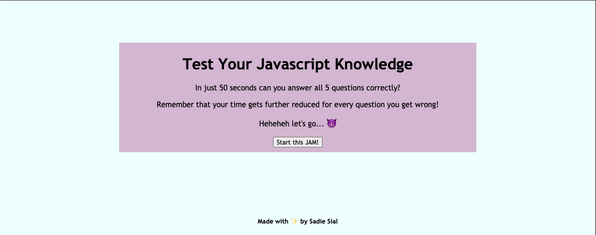
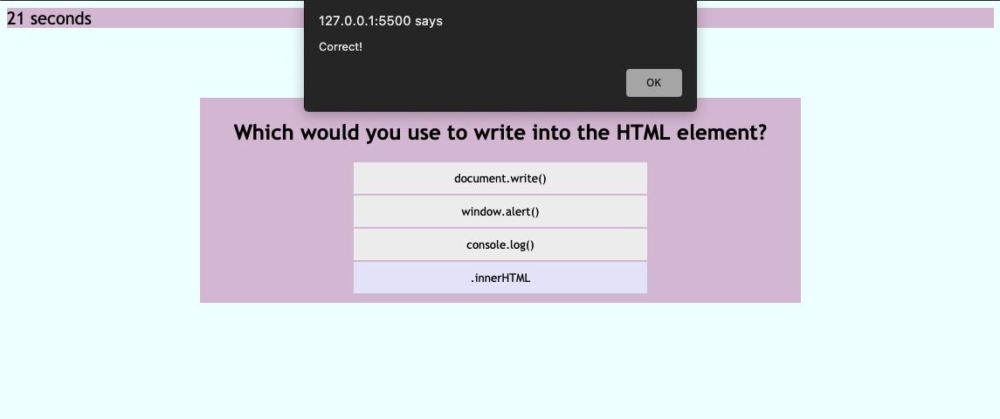
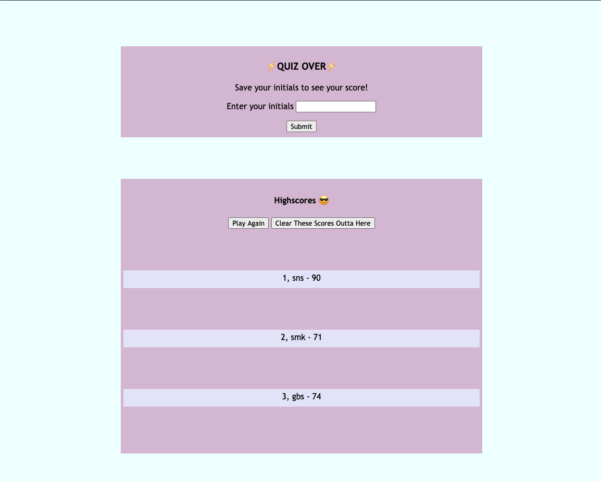

# Code Quiz (Bootcamp Assignment 4 - Web APIs)

By Sadie Sial

## User Story
```
AS A coding boot camp student
YOU WILL get to take a timed quiz on JavaScript fundamentals that stores high scores
SO THAT you can gauge your progress compared to your peers
```

```
This application allows for the user to take a timed code quiz. Their journey starts by clicking a start button then they will be presented with various questions in which incorrect responses will deduct time from their timer. Once all of the questions have been answered the timer will reach 0 and the quiz will end. When the game is over the user will be prompted to save their initials and score.
```

## Screenshots

Welcome Screen:


Quiz Screen:


End Screen:



## Links
[Deployed App](https://sadielinks.github.io/code-quiz/)

[GitHub Repository](https://github.com/sadielinks/code-quiz)